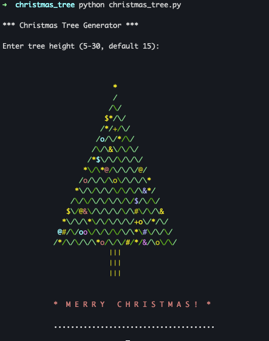

# 🎄 Christmas Tree Generator

A festive ASCII Christmas tree generator written in Python. Spread holiday cheer in your terminal!

## Features

- 🌲 Beautiful ASCII Christmas tree with customizable height
- ✨ Colorful ornaments and twinkling lights
- ⭐ Glowing star on top
- 🪵 Wooden trunk centered at the base
- ❄️ Snow ground effect
- ⏱️ Animated rendering with timing control
- 🎨 Multiple colors: green, red, yellow, blue, purple, cyan, and gold

## Requirements

- Python 3.6 or higher

## Installation

Simply clone or download the repository:

```bash
git clone <your-repo-url>
cd christmas_tree
```

## Usage

Run the script and enter your desired tree height:

```bash
python3 christmas_tree.py
```

You will be prompted to enter a tree height between 5 and 30 (default is 15):

```
Enter tree height (5-30, default 15):
```

Press Enter for the default height, or type a number and press Enter.

## Example

```bash
$ python3 christmas_tree.py
Enter tree height (5-30, default 15): 12
```



## Options

- **Height**: 5-30 (controls the size of the tree)
- The tree automatically ornaments itself with random decorations each time you run it!

## License

MIT License - Feel free to use and modify for your own festive projects!

## Contributing

Feel free to submit issues and pull requests to make this tree even more festive!

---

Merry Christmas! 🎅🎁
